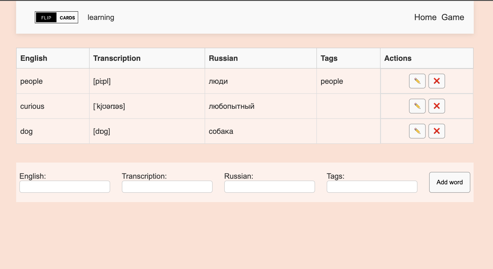

# React + Vite

This template provides a minimal setup to get React working in Vite with HMR and some ESLint rules.

Currently, two official plugins are available:

- [@vitejs/plugin-react](https://github.com/vitejs/vite-plugin-react/blob/main/packages/plugin-react) uses [Babel](https://babeljs.io/) for Fast Refresh
- [@vitejs/plugin-react-swc](https://github.com/vitejs/vite-plugin-react/blob/main/packages/plugin-react-swc) uses [SWC](https://swc.rs/) for Fast Refresh

# word-flip-app

React/Vite app for learning English vocabulary using flip cards. Add, edit, and manage your word list.

Учебный проект на React для изучения английских слов с помощью переворачивающихся карточек.  
Проект реализован с использованием **Context** и **MobX** для управления состоянием.

## Функциональность

- Добавление, удаление и редактирование слов
- Карточки показывают перевод при нажатии на кнопку
- Использование **Context** и **MobX** для управления состоянием
- Простая и интуитивная навигация по интерфейсу

## Структура репозитория

Проект представлен в трёх ветках:

- `master` — базовая версия проекта с отображением карточек, версткой и с состоянием (`useState`)
- `add-context` — версия с интеграцией **Context** для глобального управления словарем
- `add-mobx` — версия с интеграцией **MobX** для глобального управления словарем

## Технологии

- React
- MobX
- React Context
- CSS Modules
- Vite

## Скриншот приложения

